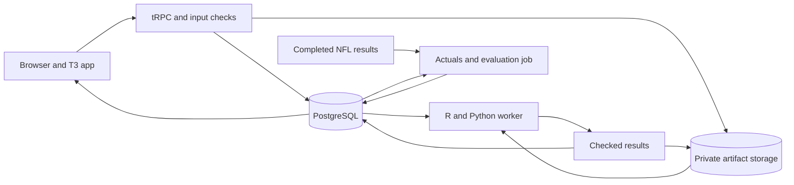

# Floor & Ceiling site PRD

Status: Proposed product requirements. The website is not implemented.

Scope correction, 2026-09-06: This site monitors player outcome forecasts. It does not implement personal-league rules or platform-specific metric variants. Keep those concepts out of the site, parser, API contracts, and worker inputs.

## 1. Product purpose

Floor & Ceiling is a weekly dashboard for judging player outcome forecasts as new results arrive. It also shows how Matt Savoca develops, challenges, and revises a model with AI assistance.

The main user question is: "Do these forecasts still describe what happens on the field?" A second question guides the methodology pages: "What evidence changed the engineer's mind?"

The first release must connect historical evidence, new projection uploads, simulation results, manual judgment, and later game outcomes. Every reported result must identify its model, metric definition, input revision, and evaluation sample.

Success requires a working weekly loop. A portfolio reader must also understand the approach without reading R or Python.

## 2. Audience, access, and scope

| Audience | Main task | Successful outcome |
| --- | --- | --- |
| Matt, as model operator | Inspect a completed week and prepare the next forecast | Identify changes, inspect their causes, and save a traceable forecast |
| Technical reviewer | Assess the engineering and statistical decisions | Trace a claim to an experiment, implementation, or measured result |
| Nontechnical stakeholder | Understand the forecast and its limits | Explain the floor, median, ceiling, and current evidence in plain language |
| Anonymous analyst | Upload projections and apply personal adjustments | Complete an isolated run and download the selected results |

First-release access uses public methodology and curated demonstration results, plus anonymous temporary browser sessions for uploads and manual overrides. Public visitors can explore all demonstration charts and tables without an account.

Only the owner can publish a public model release, select the official forecast, or replace public demonstration data. An anonymous session never changes another session.

An anonymous session is a temporary workspace. The server creates it when the user opens the forecast workflow and returns an opaque, signed, `HttpOnly` session cookie. The cookie uses `Secure` and `SameSite=Lax` in production. The session has a 24-hour inactivity limit and a seven-day absolute limit. The site shows the expiry time and tells the user to download results before the session ends.

State-changing operations use a CSRF token in addition to the session cookie. This applies to uploads, simulation jobs, overrides, resets, and official forecast selection.

The first release provides no account recovery or cross-device access for anonymous workspaces. If the cookie is lost or the session expires, the user cannot recover the upload, run, override history, or private download. The server stores a session hash and expiry data, not a personal identity.

Anonymous sessions need abuse limits because they have no account identity. Apply limits per session and a server-side network rate key. Start with 5 uploads per hour, 2 active simulation jobs, and 10 simulation jobs per day. Reject excess work with a retry time. Measure actual worker cost before raising these limits.

The first release includes five tabs: Overview, Methodology, Model Calibration, Projection to Sim, and Manual Overrides. Overview is the default route because weekly monitoring is the primary purpose.

Lineup optimization, ownership forecasts, contest returns, payments, automated betting, and arbitrary model training are outside the first release. The previous ownership system supplies override ideas, not an additional product scope.

## 3. Existing evidence and model policy

### 3.1 Current capabilities

The R package normalizes rankings and produces simulated player outcomes. The historical backtest evaluates player ranges and experimental team results. Separate Python experiments fit direct p85 models and team defense models.

The current offensive default remains the independent rank-conditioned simulation. The direct XGBoost model predicts p85 only. It cannot supply a complete floor, median, and ceiling distribution by itself.

| Model family | Existing evidence | First-release treatment |
| --- | --- | --- |
| Independent simulation | Historical player ranges and a working Week 1 workflow | Default complete range, after the serving checks in section 14 |
| Direct XGBoost p85 | Better RB, WR, and TE quantile loss across two held-out seasons. Worse QB coverage | Separate historical comparison. Forward candidate only after a compatible serving adapter exists |
| QB conditioning | No broader ceiling improvement in the recorded comparison | Methodology and historical experiment only |
| Python team defense | Historical and forward workflows run. Market baseline has lower error in both evaluated seasons | Clearly labeled experimental defense view |
| Player outcomes to NFL margins | Independent player draws do not share a coherent game state | Methodology example, outside the main weekly forecast |

Model status uses explicit labels: Baseline, Candidate, Experimental, and Retired. "Best settings" means settings selected on an earlier validation sample for a named model and position. It does not mean a universally superior model.

The site must not combine a direct p85 candidate with baseline p15 and p50 and label the result a validated 70% interval. A future hybrid needs its own model version and joint interval evaluation.

### 3.2 Historical reference scorecard

These rounded values describe the saved direct-model comparison for held-out 2024 and 2025 rows. The application must load full-precision artifact values.

| Position | Baseline p85 coverage | Direct p85 coverage | Baseline p85 loss | Direct p85 loss |
| --- | ---: | ---: | ---: | ---: |
| QB | 84.0% | 77.5% | 1.986 | 2.018 |
| RB | 87.8% | 84.9% | 1.824 | 1.564 |
| WR | 89.5% | 85.3% | 1.917 | 1.697 |
| TE | 87.1% | 84.3% | 1.618 | 1.426 |

Required explainer: "The bar runs from the estimated floor to the ceiling. The dot marks the median. Observed outcomes can fall outside the range."

Source: `backtest_fbg_2023_2025/outputs/xgb_p85_projection/metrics.csv`. Historical results remain historical after a model retrain. A new feature set or metric correction creates new results.

## 4. Visual direction and navigation

Use a familiar analysis dashboard as the visual reference. The proposed direction uses a navy navigation bar, blue actions, white tables, compact filters, and restrained gray borders.

This is an original visual system. The project uses its own name, typography treatment, icons, and page composition.

| Element | Proposed treatment |
| --- | --- |
| Header | Project name, five tabs, session menu, and owner controls when authorized |
| Context strip | Season, week, metric definition, model version, and data freshness |
| Page layout | Wide desktop content area, compact summary row, main chart or table, then supporting detail |
| Tables | Sticky header, pinned player column, numeric alignment, subtle alternating rows, visible sort state |
| Color | Navy `#12304A`, action blue `#1264A3`, white panels, page gray `#F3F5F7` as proposed tokens |
| Status | Text and an icon accompany color. Gray means unavailable or insufficient evidence |
| Charts | Labeled axes, light reference lines, consistent units, and a short explanation directly underneath |
| Mobile | Stacked panels, horizontally scrollable tables, pinned identity columns, and touch-accessible filters |

Use readable body text of at least 16 pixels. Dense table text can use 14 pixels with adequate row height. Preserve visible keyboard focus and sufficient contrast.

The live browser reference was unavailable during PRD preparation. The palette and layout are design proposals, not a measured reproduction. Visual implementation requires a direct reference review.

All tabs share the selected season, week, metric definition, and temporary workspace. Page-specific filters remain separate. Public view filters can use URL parameters for reproducible links. Private data, session identifiers, and upload locations never appear in URLs.

## 5. Overview: weekly model monitoring

### 5.1 Page contents

The first screen shows the latest completed evaluation and the next forecast's status. The header distinguishes source refresh time from forecast creation time.

The main summary contains evaluated player count, p85 coverage, 70% interval coverage, p85 loss, and matched-outcome rate. Each metric includes its comparison period and sample count.

The page then shows weekly performance trends, input changes, position breakdowns, and a list of items that need inspection. A selected item opens the matching chart and filtered player table.

The user can select a single week, the latest four completed weeks, or the season to date. The default comparison uses the same position and metric definition from the selected model's fixed historical reference.

### 5.2 Separate input changes from forecast performance

| View | Available when | Measures | Required explanation |
| --- | --- | --- | --- |
| Input changes | A new upload passes checks | Missing fields, unknown players, rank uncertainty, projected opportunity, and prediction distributions | "The incoming projections changed. Game results are needed to judge forecast accuracy." |
| Forecast performance | Completed games have usable actual scores | Quantile coverage, interval coverage, quantile loss, median error, and interval width | "These results compare forecasts saved before kickoff with completed games." |
| Data quality | At every stage | Duplicate keys, unmatched players, stale sources, missing games, and metric mismatches | "Missing data can change the result. This view shows the rows that need review." |

Input distribution comparisons use reference bins fixed at model release. Show missing values as a separate category. Numeric charts show normalized frequencies and row counts.

For an initial input-distance score, use half the sum of absolute differences between current and reference bin proportions. This score ranges from zero to one. It describes a distribution change and does not establish its cause.

A constant reference feature needs a separate changed-value rate. Categorical features include an unknown category. Position-specific views precede pooled summaries.

### 5.3 Initial monitoring rules

The following thresholds are proposed inspection rules. They require historical replay before release and remain visible in the dashboard's settings.

- Input change: distance greater than 0.20 with at least 100 current rows in the selected cohort.
- Coverage change: four-week p85 coverage differs from 85% by more than five percentage points.
- Loss change: four-week p85 loss exceeds the fixed historical reference by more than 10%.
- Performance status requires at least 100 unique player-game outcomes, 30 distinct games, and four completed weeks in the cohort.
- A coverage or loss rule must recur at two consecutive weekly evaluations before the status becomes "Needs review."
- Missing required fields, ambiguous identities, and metric mismatches create immediate data-quality items.

Small samples show "Limited sample" with the measured values. Missing actuals show "Results pending." Neither state receives a healthy status.

Overlapping windows contain repeated evidence. Repeated flags are operational prompts, not independent statistical confirmation. Team and single-player filters provide exploratory results without automatic drift status in version one.

Show uncertainty bands from a reproducible game-cluster bootstrap for performance metrics. All players and defenses from the same game remain together during resampling. If the sample has fewer than 30 games, omit the band and explain the limit.

The dashboard compares a candidate and baseline on identical eligible outcomes. It shows excluded counts and reasons. It never retrains or promotes a model automatically because a monitoring rule fires.

### 5.4 The weekly loop

1. Import the upcoming week's projections.
2. Inspect the input summary.
3. Run the selected model.
4. Review the ranges and save any manual adjustments.
5. Select the official forecast before each affected game's kickoff.
6. Ingest completed game results.
7. Inspect the updated performance and input-change views.

The owner can refresh actuals manually. A scheduled job refreshes them daily after games until all expected results arrive. Later source corrections create a new actuals revision and a new evaluation.

The official unadjusted forecast is immutable per player-game, model version, and metric definition. Kickoff closes selection for that game. An override also needs a pregame save time for prospective evaluation.

Runs created after kickoff remain accessible as retrospective analysis. They cannot enter the prospective scorecard. A missing pregame forecast remains missing and cannot be replaced with a later reconstruction.

## 6. Methodology tab

### 6.1 Model derivation timeline

Use ordered stages without calendar dates. Each stage contains the question, method, evidence, decision, and a link to supporting material.

| Order | Stage | Required narrative |
| --- | --- | --- |
| 1 | Define a useful range | Translate rankings into poor-week, typical-week, and strong-week scores. Establish p15 and p85 as the range contract |
| 2 | Connect current projections | Normalize source exports, derive ranks, and supply missing uncertainty from historical ranks |
| 3 | Build the first working run | Produce a small simulation batch and inspect player, team, and game output |
| 4 | Challenge unusually good results | Early results looked too good. Inspect the original leave-one-season-out evaluation for leakage |
| 5 | Correct the time boundary | Find future seasons in earlier forecasts. Require earlier-season data and repeat the backtest |
| 6 | Examine the tails | Compare predicted percentiles with empirical outcomes. Separate p85 from the average score beyond p85 |
| 7 | Test a shared QB environment | Link QB draws to teammate totals. Keep the baseline after the broader scorecard fails to improve |
| 8 | Fit direct ceiling models | Train one XGBoost quantile model per position. Retain the mixed result across positions |
| 9 | Explain and question the models | Use SHAP, find duplicate features, and flag questionable QB relationships |
| 10 | Extend to defense | Rebuild targets and pregame features. Compare the defense model with historical and market baselines |
| 11 | Monitor new weeks | Freeze forecasts, collect outcomes, inspect changes, and record the next decision |

The leakage stage must state the engineer's reason for returning to the evaluation design. It must identify the discarded result as invalid evidence. No invented before-and-after accuracy figures are permitted.

The corrected chronology follows the owner's account and the leakage session record. The current code enforces `season < target_season`. The field guide's remaining leave-one-season-out wording is stale.

### 6.2 Show the work with AI

Include a short evidence panel beside relevant stages. Each panel separates the owner's question or correction, the agent's implementation work, the checks, and the owner's resulting decision.

Examples include the request to investigate leakage, the correction to empirical tail charts, and the decision to preserve mixed XGBoost results. Use reviewed session excerpts or faithful summaries. Label summaries as summaries.

Link technical reviewers to the relevant code, tests, and session records after the repository is public. Public pages need readable local summaries when source access is private.

Do not invent prompts, agent autonomy claims, time savings, or productivity measurements. AI use is demonstrated through traceable work and corrections.

### 6.3 Tools, languages, and data

| Group | Existing tools or sources | Role |
| --- | --- | --- |
| R | `data.table`, `arrow`, `nflreadr`, `ggplot2`, `testthat` | Adapters, outcome history, simulation, backtests, plots, and tests |
| Python | XGBoost, SHAP, NumPy, pandas, Polars, PyArrow, `nflreadpy`, matplotlib | Direct quantile models, explanations, defense features, and model artifacts |
| Experimental NFL path | `nflseedR` | Game-margin experiments from team signals |
| Sources | Approved projection source, archived rankings, nflverse statistics and play-by-play | Projections, historical rank behavior, targets, and pregame context |
| Engineering practice | Git, GitHub, agent session records, developer field guide | Code history, decisions, corrections, and reusable lessons |
| Planned site | TypeScript, Next.js, Tailwind CSS, tRPC, Prisma, PostgreSQL, signed session cookies | Interface, application API, temporary workspace data, and access control |

Metric definitions explain their value rules in plain language. The initial project metric is versioned, stored with each result, and checked at the web and worker boundaries.

The data panel shows source coverage, selected projection set, identity match rate, and training cutoff. Historical data availability and the target forecast season appear as separate fields.

## 7. Model Calibration tab

### 7.1 Tables of selected settings

Provide filters for model family, position, metric definition, and held-out season. Show one row per selected model and evaluation fold.

For XGBoost, include training seasons, validation season and weeks, objective, quantile, feature count, tree depth, minimum child weight, learning rate, sampling settings, regularization, and boosting rounds. An expandable field list shows exact feature names.

For the simulator, show outcome-history seasons, ranking source, uncertainty method, uncertainty multiplier, simulation count, and seed policy. These are simulation settings rather than tree parameters.

Defense settings come from the defense model's metadata and tuning files. Point and quantile models remain separate rows.

Required explainer: "These settings won an earlier validation comparison. The results below use later seasons that the model did not train on."

Use `selected_models.csv`, run manifests, and defense model metadata as the source. Preserve all held-out folds. A selected row must link to the matching result row and model version.

### 7.2 Results and metric definitions

| Metric | Definition | Explainer directly under its table or chart |
| --- | --- | --- |
| p85 coverage | Share with `actual_score <= p85` | "The target is about 85% of scores at or below the ceiling. Higher coverage can mean the ceiling is too generous." |
| p15 coverage | Share with `actual_score <= p15` | "The target is about 15% of scores at or below the floor. Scores tied at zero can affect this percentage." |
| Median coverage | Share with `actual_score <= p50` | "The target is about half of scores at or below the median." |
| 70% interval coverage | Share with `p15 <= actual_score <= p85` | "This range aims to contain about 70% of scores. It is not a minimum or maximum." |
| Quantile loss | Mean pinball loss at the selected quantile | "Lower is better. This measure penalizes misses according to the percentile that the model predicts." |
| Median absolute error | Mean of `abs(actual_outcome - p50)` | "This is the average distance between the median forecast and the actual outcome." |
| Median signed error | Mean of `actual_score - p50` | "A positive value means players scored more than the model's median estimate, on average." |
| Interval width | Mean of `p85 - p15` | "A wider range covers more possible scores. Coverage shows whether that extra width is useful." |
| Boom capture | Share of defined high-outcome games in the highest-ranked forecast fifth | "This shows how many high-outcome games appeared among the top 20% of forecasts." |

In formulas, let `u = actual_score - predicted_quantile`. Pinball loss is `max(q * u, (q - 1) * u)`. Average the row losses over the eligible sample. See the [scikit-learn quantile metric reference](https://scikit-learn.org/stable/modules/model_evaluation.html#pinball-loss).

Report strict-less-than, equal-to, and greater-than counts for quantile coverage. Discrete scores and a mass at zero limit an exact nominal-coverage interpretation.

The legacy `p85_bias` field is a mean pointwise distance. Do not label it quantile calibration bias. Show empirical bin bias separately as `empirical_p85 - predicted_bin_value`.

Historical boom capture retains the recorded sample-relative definition and labels it retrospective. Prospective boom thresholds are fixed by position from the reference data before the season. Each view shows its definition and denominator.

For defense point models, include root mean squared error, mean absolute error, and both baselines. Count unique team-games for headline results. Reduce scenario predictions to one forecast per team-game before evaluation. Display legacy scenario-weighted artifacts only with their original weighting label.

### 7.3 Required interactive visualizations

| Visualization | Data and marks | Required interaction | Explainer |
| --- | --- | --- | --- |
| Quantile calibration | Predicted quantile bins on x. Empirical observed quantile on y. Equal-scale diagonal reference | Select p15, p50, or p85. Filter position and season. Click a bin to open its rows. Reset zoom | "Points near the diagonal match the selected percentile. Small groups can move sharply between samples." |
| Coverage over weeks | Weekly and four-week coverage, reference target, and uncertainty band | Select a range. Toggle models. Click a week to inspect players | "The line shows how often actual scores stayed below the estimate. The band shows sampling uncertainty." |
| Error distribution | Histogram of `actual_score - p50`, with zero reference | Select bins to filter the row table. Switch position. Compare the baseline on identical rows | "Values above zero mean the median forecast was too low. Values below zero mean it was too high." |
| Candidate versus baseline | Paired quantile-loss differences by position and week | Change candidate. Inspect contributing rows. Toggle absolute loss and paired difference | "Negative differences favor the candidate. Both models use the same games in this comparison." |
| Ceiling misses | p85 forecast on x and actual score on y | Select points, search players, inspect a player-game, and reset selection | "Some scores can exceed p85. One large miss does not establish poor calibration." |

Calibration bins use the repository's half-up rounding and empirical type-7 quantile definitions. Counts accompany every bin. Chart zoom changes the visible domain without changing summary values.

All charts require tooltips, visible filter state, reset controls, and a linked accessible table. Table controls must provide an equivalent path for keyboard users. Static PNGs alone do not satisfy these requirements.

An optional SHAP drawer can show saved feature contributions for a historical example. It must preserve the duplicate-feature warning and state that contributions describe model behavior, not game causation.

## 8. Projection to Sim tab

### 8.1 Upload and preview

The user selects season, week, and the supported metric definition, then uploads a projection CSV. The public demonstration uses the owner-cleared Week 1 output stored in the repository. The upload belongs to the current anonymous session.

Initial upload limits are 10 MB and 50,000 rows. The server checks file content, required fields, numeric values, duplicate keys, position aliases, team aliases, and supported season-week values.

The preview shows filename, source timestamp if present, season, week, all detected sets, accepted rows, excluded rows, and unresolved rows. The app distinguishes the upload time from the provider's publication time.

Projection set names repeat. The user selects a concrete `set_id` with its position counts. The app can suggest the approved projection set but must show the selection.

The adapter reports how it derives rank and uncertainty. For the current consensus baseline, preserve source order within position when the file lacks explicit rank. Match current adapter behavior rather than silently sorting by projected points.

Scope includes QB, RB, WR, and TE. Report free-agent and unsupported-position exclusions. Defense is a separate optional experimental output from the defense model. Kicker output remains unavailable until the source contract supports it.

Unknown historical identities require resolution or explicit exclusion before a run. The app never silently joins players by name alone. A downloadable row report gives the cause and the suggested correction.

Single-set uploads can lack features used by multi-projector historical models. Missing required candidate features disable that candidate with a clear explanation. The baseline can remain available if its own input checks pass.

### 8.2 Update Floor/Ceiling

The exact primary action label is "Update Floor/Ceiling". Enable it only after the upload passes the selected model's input checks.

The first release offers a 1,000-simulation standard run. A 100-simulation demonstration run carries a preview label and cannot become an official forecast. Larger runs remain an owner setting until runtime measurements support a public limit.

The worker runs fixed model artifacts and outcome pools. Uploads do not trigger training. Every run records the seed, simulation count, input revision, metric definition, and model version.

Run states are Empty, Checking upload, Ready, Queued, Running, Complete, Failed, and Canceled. A failed run retains the prior complete result. The user can inspect the failure and retry the same input.

Repeated button presses return the existing queued or running job for the same submission token. A changed input creates a new run. Refreshing the page restores the active job and completed results.

"Reset upload" clears the draft and restores the sample selection. It cancels queued work when possible and detaches running work from the current draft. An old job completion must never replace a newer selection. Reset does not extend the session expiry time.

Reset does not delete saved forecasts or prior evaluations. Those records remain available from run history.

### 8.3 Output table and CSV

Default columns are player, position, team, opponent, floor, median, ceiling, range width, source projection, and adjustment status. Every applicable column supports numeric or text sorting.

The user can search players, filter by `pos` and `team`, select columns, and switch between original and adjusted views. The table and charts use the same filtered rows.

Download actions distinguish "Download filtered rows" from "Download all rows." The menu shows the row count and original or adjusted view before export. Filtered export includes every matching row, including rows outside the visible page.

CSV fields include stable player ID, season, week, metric definition, model version, run ID, source projection, original p15/p50/p85, adjusted range values, exclusion state, and override revision. Use UTF-8 and proper CSV quoting. Escape spreadsheet formula prefixes in text fields without altering numeric outcomes.

Downloads preserve full numeric precision. The table displays one decimal by default. Sorting uses the underlying values.

### 8.4 Interactive player ranges

The primary chart uses one horizontal interval per player. The floor and ceiling form the ends, and a distinct point marks the median. Tooltips show exact values and source projection separately.

Required controls include position, team, player search, sort metric, original or adjusted view, and a visible player-count limit. Initially show 25 players and provide pagination or a count selector.

A second chart compares median against ceiling, with position color and a linked selection. Selecting a player in either chart opens the same detail drawer and highlights the corresponding table row.

The drawer shows the original simulation histogram when draws exist. It must not invent a distribution from three edited numbers or a direct p85 prediction.

Required explainer: "The bar runs from the estimated floor to the ceiling. The dot marks the median. Actual scores can fall outside the bar."

No-results, failed-run, pending-run, and unavailable-draw states have specific text and a useful next action.

## 9. Manual Overrides tab

### 9.1 Preserve the earlier intent

The previous project contains live quantile summaries and older tail-mean summaries. Its manual reductions occur in several older paths with inconsistent floor behavior. Some controls depend on undefined session variables.

The website uses one explicit override layer over the selected run. It retains the current p15/p50/p85 definition and stores adjustments separately. Edited values are labeled "Adjusted floor," "Adjusted median," and "Adjusted ceiling."

### 9.2 Controls and exact behavior

| Control | Proposed behavior | Relationship to the earlier project |
| --- | --- | --- |
| Workload preset | Full = 1.0, Half = 0.5, Quarter = 0.25. Multiply all three range values by the selected factor | Preserves the half-game and quarter-game idea. Scaling the median is an explicit new consistency choice |
| Custom workload factor | Accept a factor from 0 to 2.0. Preview its effect on all three values | Makes the multiplier visible and editable |
| Mark inactive | Set adjusted floor, median, and ceiling to zero. Keep the player visible with an Inactive label | Makes the earlier player-zero control explicit |
| Exclude from export | Keep the row visible in the workspace. Exclude it only from the default active-player export | Separates a selection decision from a zero-score forecast |
| Edit values | Set an adjusted floor, median, or ceiling directly | Replaces hardcoded per-player assignments with a saved user action |
| Analyst point projection | Store a separate optional point estimate. Keep the original provider projection unchanged | Preserves fixed-projection judgment without pretending a point estimate is a median |
| Legacy defense uplift | For DST only, multiply ceiling by 2.5 when ceiling is less than 1.25 times the selected point projection | Preserves the old heuristic as an opt-in experimental preset |

The legacy defense rule remains off by default. It uses the analyst point projection when present, otherwise the provider point projection. A missing point projection disables the rule. A nonpositive ceiling requires direct editing because multiplication cannot provide the intended upside correction.

The old heuristic is a manual judgment, not evidence of calibration. Ownership caps, optimizer standard-deviation scaling, and platform salary rules remain outside this tab.

### 9.3 Precedence and checks

Each player has one saved override specification per run revision. Repeated edits recompute from the original values, so multipliers never compound accidentally. The specification belongs to the current anonymous session and expires with that session.

Apply the workload factor first, the optional defense preset second, and explicit range edits last. Mark inactive takes priority and disables the other range controls. Export exclusion is independent.

Require finite values and `floor <= median <= ceiling`. Negative outcome values remain valid when the metric definition permits them, including defense outcomes. Reject invalid order with a field-level explanation. Do not silently clamp or sort the values.

For a direct range edit, show the exact field and point change. For workload scaling, show the factor and all three resulting changes. Rounding occurs only in display and export formatting.

The source projection is read-only. Changing an analyst point projection does not rerun the model or alter original draws. It affects only the named manual rule that consumes it.

### 9.4 Save, reset, and evaluation

The editor shows original and adjusted values side by side, the reason, and the affected player count. A reason is required for a saved adjustment. Bulk actions show an explicit selection count. The editor identifies the actor as the current anonymous session, not as a named person.

Actions are Preview changes, Save overrides, Reset player, and Reset all overrides. Reset creates a reversible revision that restores original values. The history records the author, time, reason, previous values, and new values.

Use stable IDs rather than player names for matching. An override belongs to one run, week, metric definition, and temporary workspace. A new upload starts with no active overrides. "Copy prior overrides" produces a reviewable draft and reports unmatched players. Copying works only inside the same unexpired session.

Saved adjustments update the adjusted tables, interval charts, and exports together. Arbitrary edits do not change original draws, team aggregates, or the trained model. The UI states this limit beside the save action.

Official model calibration uses original pregame forecasts. A separate "With manual adjustments" view evaluates pregame adjusted values on the same outcomes. Exclusion from an export never removes a player from the original model's evaluation.

## 10. Technical design

### 10.1 T3 application

Use Create T3 App with Next.js App Router, TypeScript, Tailwind CSS, tRPC, Prisma, and PostgreSQL. This selects components from the modular [T3 stack](https://create.t3.gg/en/introduction). The first release uses signed anonymous session cookies instead of end-user accounts. Add NextAuth.js later if the site needs named accounts or cross-device recovery. Keep owner publication controls behind a separate authenticated admin path.

Use TanStack Table for sortable, filtered tables. Use Apache ECharts for the interactive chart layer. Its [event and action API](https://echarts.apache.org/handbook/en/concepts/event/) supports linked selection, chart clicks, and zoom events.

Pin compatible dependency versions during implementation. Keep metric formulas and model inference outside React components. The server supplies checked numeric results and explicit sample definitions.

Proposed repository layout:

```text
web/                         T3 app and web tests
services/model-worker/       Container entry point for R and Python jobs
contracts/                   Versioned JSON input and output schemas
site-content/                Public methodology and approved demo summaries
docs/                        PRD and supporting design decisions
R/                           Existing package functions
backtest_fbg_2023_2025/       Existing experiments and data preparation
```

### 10.2 Runtime boundaries



The web process accepts work and returns a job ID. A separate worker executes the existing R and Python paths with fixed arguments. Long simulations never occupy a browser request.

The first deployment needs one web service, one bounded worker service, PostgreSQL, and private object storage. A persistent container is the initial worker target. Select a hosting vendor after one end-to-end workload measurement. Configure cleanup jobs for expired anonymous sessions and their private artifacts.

The worker reads a versioned job specification. It writes temporary output, checks row counts, keys, numeric values, and model identity, then publishes a complete result atomically.

Use durable job state and atomic database claims. A timed-out worker can retry the same job without publishing duplicate results. A reconnecting browser reads job state from the server.

Store only approved jobs in the queue. Never pass a user's filename, model identifier, or CSV cell as shell code. Package the internal `ffsimulator` dependency at a fixed revision in the worker image.

The R and Python boundary uses versioned JSON schemas and artifact tables. Runtime checks enforce those schemas. TypeScript types alone cannot establish cross-language correctness.

### 10.3 Minimum data records

| Record | Required identity and content |
| --- | --- |
| Anonymous workspace | ID, session hash, creation time, last activity, inactivity expiry, absolute expiry, and rate-limit state |
| Projection upload | Workspace, source, season, week, source time, upload time, selected set, original file, row report |
| Metric definition | Version, complete stat weights, position bonuses, target construction rules |
| Model version | Family, position support, status, feature contract, training cutoff, selected settings, artifact location |
| Simulation run | Upload, model, metric definition, seed, count, state, attempts, result location, creation and completion times |
| Player forecast | Run, stable player ID, position, team, opponent, game, source projection, p15, p50, p85 |
| Official forecast | Workspace, player-game, model version, metric definition, selected run, selection time, kickoff cutoff |
| Override revision | Run, player ID, session actor, reason, specification, original values, adjusted values, save time |
| Actual outcome | Player-game or defense team-game, metric definition, source revision, completion status, outcome value |
| Evaluation | Forecast cohort, actuals revision, metric definition version, counts, exclusions, aggregate results |

Defense identity uses `season`, `week`, `game_id`, and `def_team`. Scenario rows also include `simulation_id`. Evaluate the unique team-game forecast rather than counting each scenario as another observed game.

Player joins use stable IDs and the game schedule. Names are labels. Do not multiply outcomes through a many-to-many join.

### 10.4 API operations

| Area | Operations |
| --- | --- |
| Uploads | Create, inspect, select set, resolve row errors, reset draft |
| Runs | Start, get state, list results, request cancellation, select official forecast |
| Forecasts | Query filtered rows, fetch player detail, export all or filtered rows |
| Overrides | Preview, save revision, reset player, reset run, copy into a new draft |
| Calibration | Query metrics, bins, paired comparisons, selected settings, and contributing rows |
| Monitoring | Query weekly trends, reference distributions, and inspection items |
| Owner controls | Refresh actuals, publish a model release, publish curated demonstration results |

All private operations require a valid unexpired session cookie on the server. The server compares the session hash with the workspace record before every read or write. Downloads use short-lived authorized access tied to that session. Public pages read a separate approved dataset.

## 11. Failure behavior and data limits

| Failure combination | Required behavior |
| --- | --- |
| Source changes columns and a numeric field parses as text | Fail the affected model's input checks. Show the field and sample row. Preserve the prior result |
| A player name changes and several identities match | Require explicit identity resolution. Keep the row out of evaluation until resolved |
| The user uploads again while an earlier run finishes | Attach each result to its own upload. Keep the current selection on the newer draft |
| A worker stops after producing partial output | Keep the run incomplete. Retry without exposing partial tables |
| Game results are delayed or corrected | Show Pending or Revised. Recompute evaluations against a named actuals revision |
| A model requires unavailable features | Disable that candidate and explain the missing inputs. Never substitute undocumented values |
| An override violates percentile order | Reject the save and preserve the prior revision |
| A model release changes midway through the season | Segment trends by version. Preserve the earlier reference and forecast records |
| Private source material enters a public demo | Publish only the explicit public dataset. Keep anonymous uploads, session records, and detailed source exports private |

An absent score row is not automatically zero. Completed inactive players need an explicit roster or participation rule before assigning zero. Unresolved absences remain missing.

Use final game state to determine actuals completeness. Rescheduled, canceled, and incomplete games remain outside the eligible denominator until their state supports evaluation.

Raw provider uploads remain private and expire with the anonymous session. Public examples use data the owner permits for publication. A missing historical provider timestamp means the site cannot claim that export was captured before kickoff.

The current archived backtest supports earlier-season model training claims. Strict source-vintage claims require timestamp evidence that the archive does not necessarily contain.

## 12. Performance, accessibility, and operational targets

These are release targets, not measurements of the current repository.

- A cached 1,000-row forecast view becomes usable within two seconds at the 95th percentile on the agreed desktop test device.
- Sorting and filtering that view completes within 200 milliseconds at the 95th percentile.
- A job-start request returns within two seconds. Progress state refreshes at least every five seconds while the page is active.
- Measure a real 1,000-simulation batch on the chosen worker before setting a job timeout or promising a completion time.
- Start with two active simulation jobs per anonymous session and two active jobs per worker. Measure memory before increasing concurrency.
- All core workflows work with a keyboard and at 200% zoom. Chart selections have equivalent table controls.
- At a 390-pixel viewport, the user can upload, inspect status, filter results, edit a player, and download a CSV.
- Error messages state what failed and the next action. They do not expose credentials, internal paths, or another user's data.

## 13. Delivery sequence

| Stage | Working deliverable | Exit evidence |
| --- | --- | --- |
| A. Public evidence | T3 shell, Methodology, selected settings, and interactive historical calibration | Saved artifact values match the site. A reviewer can inspect the leakage correction and mixed model results |
| B. Weekly forecast | Anonymous temporary upload, checks, real worker job, sortable table, range charts, reset, and CSV | A supplied FBG fixture passes through the complete browser workflow |
| C. Manual judgment | One override implementation, revisions, previews, resets, and adjusted exports | Half, quarter, inactive, direct edit, and defense preset examples produce the specified values |
| D. Monitoring | Pregame selection, actuals ingestion, unique-outcome metrics, weekly trends, and inspection rules | Replay several completed weeks without future data or duplicated outcomes |
| E. Release | Responsive styling, access checks, accessible controls, deployable worker, and owner documentation | End-to-end release checks pass on the deployment target |

Stage D is required for the first full product release because monitoring is the primary purpose. Stage A can serve as an earlier public preview with its limited scope stated.

## 14. Acceptance criteria

### Product behavior

- The default route is Overview, and all five tabs preserve the shared context.
- The methodology timeline has ordered stages and no calendar dates.
- The timeline explains that unusually good results prompted the leakage investigation and a corrected backtest.
- Every selected-parameter table links to the matching model, fold, and results.
- Every required calibration chart responds to filters and exposes contributing data through a linked table.
- Every statistical table and chart has a short plain-English explanation directly underneath.
- A valid FBG upload enables "Update Floor/Ceiling." An invalid upload gives a row-level report.
- A real worker result supports sortable columns, all-row and filtered CSV exports, and interactive `pos` and `team` range filters.
- Reset upload, Reset player, and Reset all overrides have separate, reversible behavior.
- An override changes every adjusted view consistently while preserving original predictions.
- Two anonymous sessions cannot read or change each other's uploads, runs, overrides, or exports.
- A lost or expired session cannot recover private workspace data, and expired data is removed by cleanup work.
- Anonymous rate limits prevent a session from starting more than the configured number of uploads or jobs.

### Statistical and serving behavior

- Every historical training season precedes its target season. Tests include an explicit future-season rejection case.
- Prospective evaluation includes only forecasts selected before the corresponding game begins.
- Repeated simulations do not increase the observed player-game or team-game count.
- Candidate comparisons use the same outcomes and report excluded rows.
- Coverage, type-7 calibration bins, and pinball loss agree with direct calculations on fixture data.
- Quantile ties and unresolved actuals have explicit counts.
- A ceiling-only candidate never appears as a complete calibrated range.
- An arbitrary manual edit never produces an invented histogram or a changed official model scorecard.
- Input-change and performance-change states remain distinguishable when actuals are pending.

### Known implementation prerequisites

- Resolve the Week 1 script's season-pool workaround before presenting its output as a position-complete weekly model. Reuse the backtest's weekly builder where supported.
- Check the metric formula on identical recorded statistics in R, Python, projections, and actuals. Keep the input and output definitions aligned across each boundary.
- Preserve historical results if that metric check requires a correction. Regenerate corrected results under a new metric version.
- Remove one duplicate projection-score feature before a candidate retrain. The current saved-model explanations retain the existing duplicate-feature warning.
- Build a general season-week worker entry point. The current Week 1 script is a snapshot workflow.
- Check candidate feature availability against the actual upload format. Build the forward adapter before enabling candidate inference.
- Export the selected-setting and result artifacts into the serving format. Several current artifacts are local ignored files.
- Recompute defense headline metrics on unique team-games. Keep earlier scenario-weighted results labeled for traceability.

### Evidence required before release

Use focused unit tests for quantile calculations, identity joins, metric parity, override precedence, and cutoff rules. Use integration tests for worker retries and actuals revisions. Use browser tests for upload, reset, filtering, overrides, authorization, and CSV contents.

Run one real fixture end to end on the deployment target. Compare accepted, excluded, forecast, and downloaded row counts. Record wall time and peak worker memory for that batch.

## 15. Assumptions and remaining decisions

| Item | Proposed default or next decision |
| --- | --- |
| Access | Public demonstration plus anonymous temporary browser sessions for uploads and overrides |
| Authentication provider | No end-user account in the first release. Use a signed session cookie. Protect owner publication controls through a separate admin path |
| Metric definition | One versioned project metric first. Additional definitions require metric-parity checks |
| Default forecast | Complete independent simulation. Direct p85 remains a separate candidate |
| Workload reductions | Scale floor, median, and ceiling together. Keep provider projection unchanged |
| Hosting | Web service plus persistent worker, PostgreSQL, and private object storage. Select the vendor after a measured fixture run |
| Published examples | Curated aggregate evidence and owner-cleared player samples |
| Model promotion | Owner decision after documented evaluation. No automatic replacement |

## 16. Source map

Repository sources establish current behavior. This PRD's new behavior is a proposal.

- [Project architecture](../field-guide/architecture.md), [model experimentation](../field-guide/model-experimentation.md), and [historical backtest](../backtest_fbg_2023_2025/README.md).
- [Leakage correction](../.agent-sessions/2026-09-03-remove-backtest-data-leakage.md), [direct p85 experiment](../.agent-sessions/2026-09-04-xgb-p85-projection.md), [SHAP review](../.agent-sessions/2026-09-04-xgb-p85-shap.md), and [defense implementation](../.agent-sessions/2026-09-06-dst-xgb-prd.md).
- [Current metric code](../web/lib/metrics.ts), [worker contract](../contracts/model-job.v1.json), and [Week 1 output](../outputs/week1_2026_player_ranges.csv).
- Selected artifacts: `outputs/xgb_p85_projection/selected_models.csv`, `metrics.csv`, and `shap/model_checks.csv` beneath `backtest_fbg_2023_2025/`.
- Defense artifacts: `outputs/dst_xgb/models/dst_model_metadata.json`, `dst_tuning_target_2026.csv`, and `outputs/dst_xgb/dst_backtest_metrics.csv` beneath the backtest directory.
- [Earlier override implementation](https://github.com/mattsavoca/rostership-model-4for4/blob/main/R/adjustments_and_utils.R), [tail-mean summaries](https://github.com/mattsavoca/rostership-model-4for4/blob/main/R/simulation_functions.R), and [manual point projections](https://github.com/mattsavoca/rostership-model-4for4/blob/main/R/manual_fp_proj_adjustments.R). These sources require repository access while private.
- Owner-supplied local reference: `Floor Ceiling Design Doc.dc(1).html`. Its sections 4, 5, 6, and 10 explain the older override paths and conflicting range definitions.
- [T3 introduction](https://create.t3.gg/en/introduction) and the current repository source map.
